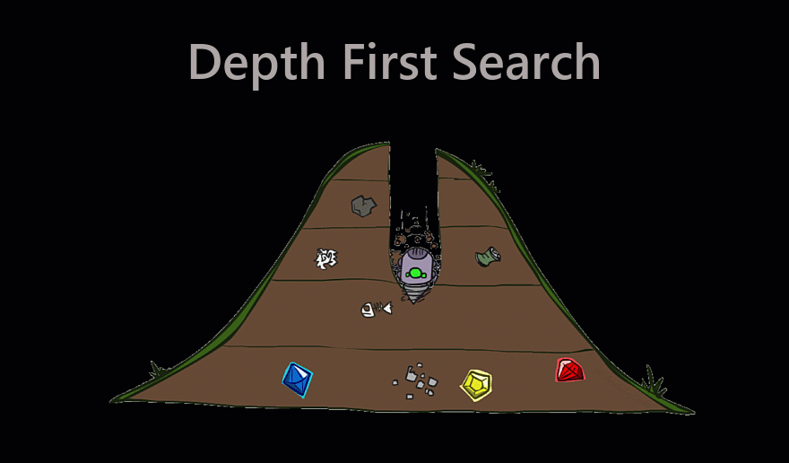
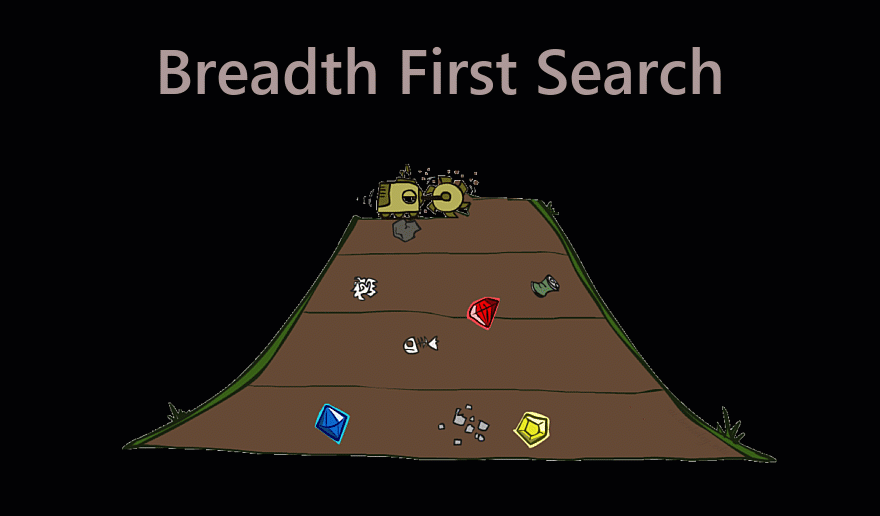
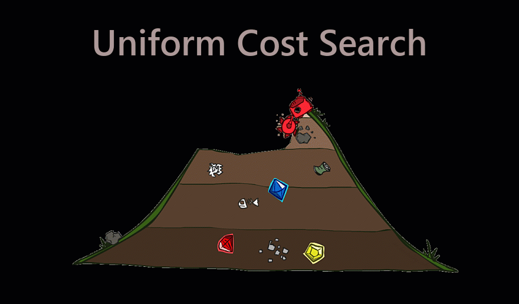
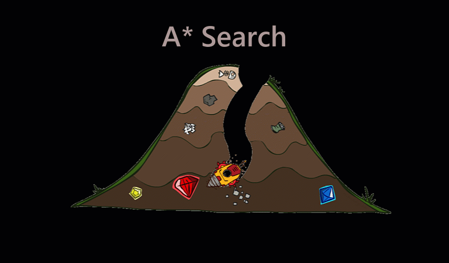
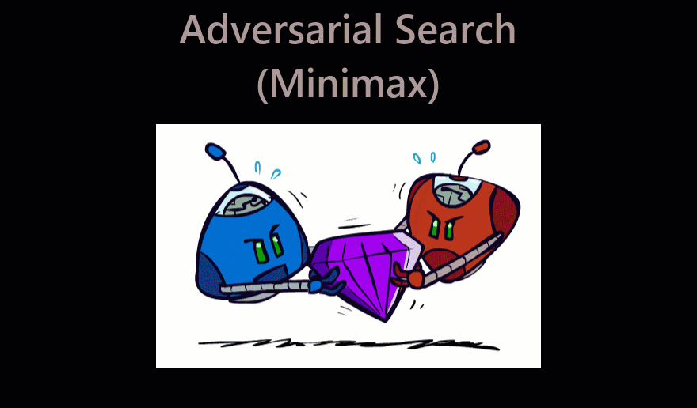
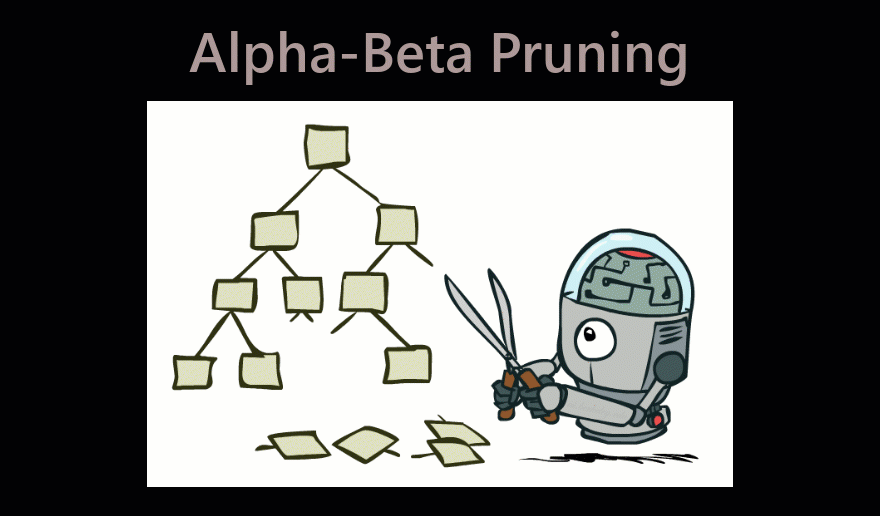

  
 <p align="center">
   <h1 align="center">Pacman Search</h1>
</p>
<p align="center">
  
</p>

---
An array of AI techniques is employed to playing Pac-Man . Following `Informed, Uninformed and Adversarial Search` algorithms are implemented in this project.
- **Informed Search**: 
  - Breadth First Search
  - Depth First Search
  - Uniform Cost Search
- **Uninformed Search**: 
  - A* Search
- **Adversarial Search**: 
  - Minimax Search
  - Alpha-Beta Pruning

## 1. Depth First Search
>  Expand deepest node.
```python
cd Informed and Uninformed Search
python pacman.py -l mediumMaze -p SearchAgent -z .8 --frameTime 0.05
```
<p align="center">
  
</p>

## 2. Breadth First Search
> Expand shallowest node.
``` python
cd Informed and Uninformed Search
python pacman.py -l mediumMaze -p SearchAgent -a fn=bfs -z .8 --frameTime 0.05
```
<p align="center">
  
</p>

## 3. Uniform Cost Search
> Expand least cost node.
```python
cd Informed and Uninformed Search
python pacman.py -l mediumMaze -p SearchAgent -a fn=ucs -z .8 --frameTime 0.05
```
<p align="center">
  
</p>

## 4. A* Search
> Minimize the total estimated solution cost.
```python
cd Informed and Uninformed Search
python pacman.py -l mediumMaze -p SearchAgent -a fn=astar,heuristic=manhattanHeuristic -z .8 --frameTime 0.05
```
<p align="center">
  
</p>

## 5. Adversarial Search (Minimax)
> Max maximizes results, Min minimizes results. Compute each node’s minimax value’s the best achievable utility against an optimal adversary.
``` python
cd Adversarial Search
python pacman.py -p MinimaxAgent -l smallClassic -a depth=2 --frameTime 0
```
<p align="center">
  
</p>

## 6. Alpha-Beta Pruning
> Minimax: generates the entire game search space. Alpha-Beta algorithm: prune large chunks of the trees.
``` python
cd Adversarial Search
python pacman.py -p AlphaBetaAgent -l smallClassic -a depth=3 --frameTime 0
```
<p align="center">
  
</p>

## References
[UC Berkeley's introductory artificial intelligence course, CS 188.](http://ai.berkeley.edu/home.html)
